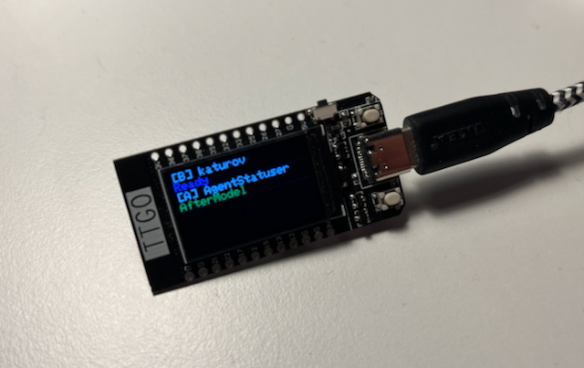

# 📟 Gemini Agent Monitor (ESP32)

A visual monitoring system for Gemini CLI agents on an external **LilyGo TTGO T-Display** screen.



## Why do you need this?
When running complex tasks, Gemini CLI may spawn sub-agents or perform long-running operations. This system allows you to:
* See the real-time status without checking logs.
* Track multiple agents simultaneously (each with its own widget).
* Identify which folder (project) the action is currently taking place in.
* Instantly recognize tool execution requests (red status for permission).

## 🚀 Performance: Rust vs Python Hooks

Since Gemini CLI triggers hooks synchronously for every major event, the speed of the hook script directly impacts the responsiveness of the CLI. We compared the original Python hook with a compiled Rust version.

### Benchmark Results (200 iterations)
| Metric | Python Hook | Rust Hook |
| :--- | :--- | :--- |
| **Total Time** | 8.15 seconds | 0.57 seconds |
| **Per Call** | **~40.76 ms** | **~2.85 ms** |
| **Speedup** | 1x | **14.28x faster** |

**Why the difference?** Python spends ~40ms just to initialize the interpreter and import modules for every single call. Rust is a native binary that executes instantly, making the "Agent Status" updates completely transparent and lag-free.

---

## 🛠️ Rust Hook Installation & Compilation

If you want the best performance, follow these steps to compile and use the Rust version:

### 1. Install Rust
If you don't have Rust installed, run the official installer:
```bash
curl --proto '=https' --tlsv1.2 -sSf https://sh.rustup.rs | sh
```
Follow the prompts and restart your terminal.

### 2. Compile the Hook
Navigate to the project and build the release binary:
```bash
cd scripts/rust_hook
cargo build --release
```
The compiled binary will be located at `scripts/rust_hook/target/release/rust_hook`.

### 3. Deploy
Copy the binary to a permanent location:
```bash
mkdir -p ~/Utils/GeminiHooks/
cp target/release/rust_hook ~/Utils/GeminiHooks/
```

### 4. Update Gemini Configuration
Update your `~/.gemini/settings.json` to use the binary directly instead of `python3 hook.py`:
```json
"command": "/Users/YOUR_USER/Utils/GeminiHooks/rust_hook"
```

---

## 🏗️ How it works
The system uses **Redis** as a broker. This ensures that Gemini is not blocked when sending data to a potentially slow Serial port. A dedicated "bridge" (`bridge.py`) monitors process activity and updates the widgets on the screen.

## Display Logic (LRU Stack)
The ESP32 screen displays up to **4 most recent active sources**:
* If an update comes from an existing source, its widget moves to the **top slot**.
* When a new source appears, it is added to the top, shifting others down. If all slots are full, the oldest (bottom) one is removed.
* Each widget consists of two lines:
  * **Line 1:** `[Source] Folder` (White color).
  * **Line 2:** `Current Status` (Color-coded status).

## Quota Visualization (Right Sidebar)
The right side of the screen features three vertical bars representing your current Google Cloud quota usage for different model families. This data is fetched via internal Google APIs and updated every **2 minutes**.

* **L (Flash-Lite):** Usage of `gemini-1.5-flash-lite` and similar models. (Cyan bar)
* **F (Flash):** Usage of `gemini-1.5-flash`, `gemini-2.0-flash`, etc. (Yellow bar)
* **P (Pro):** Usage of `gemini-1.5-pro` and other Pro models. (Magenta bar)

**How to read the bars:**
* Each bar is an outline (abris) that fills from **bottom to top**.
* An empty bar means 0% usage (full quota available).
* A bar filled to the top means 100% usage (quota exhausted).

## Quick Start
1. **Hardware:** Connect your ESP32 via USB or Bluetooth. The firmware is located in `ESP32-D0WDQ6/main.cpp`. Build and upload it using PlatformIO.
2. **Bluetooth Setup (Optional):**
   - Pair your PC with the device named **AgentStatuser**.
   - Identify the Bluetooth Serial port (e.g., `/dev/cu.AgentStatuser` on macOS).
   - Update `SERIAL_PORT` in your `.env` file.
3. **Docker:** Start Redis: `docker run -d --name gemini-redis -p 6379:6379 redis:alpine`.
3. **Bridge:** Start the background process: `python3 scripts/bridge.py`.
   * *Note:* PID protection is implemented via `bridge.pid`. If another instance is running, the script will show an error.
4. **Configuration:** Add the hooks to your Gemini settings (see below).

## Hooks Installation
To enable monitoring, you need to register the `hook.py` script in your Gemini CLI configuration. Open `~/.gemini/settings.json` and add the following configuration:

```json
{
  "hooksConfig": {
    "enabled": true,
    "notifications": true
  },
  "hooks": {
    "SessionStart": [
      {
        "hooks": [
          {
            "type": "command",
            "command": "python3 /Users/username/AgentStatuser/scripts/hook.py"
          }
        ]
      }
    ],
    "SessionEnd": [
      {
        "hooks": [
          {
            "type": "command",
            "command": "python3 /Users/username/AgentStatuser/scripts/hook.py"
          }
        ]
      }
    ],
    "BeforeModel": [
      {
        "hooks": [
          {
            "type": "command",
            "command": "python3 /Users/username/AgentStatuser/scripts/hook.py"
          }
        ]
      }
    ],
    "AfterModel": [
      {
        "hooks": [
          {
            "type": "command",
            "command": "python3 /Users/username/AgentStatuser/scripts/hook.py"
          }
        ]
      }
    ],
    "BeforeToolSelection": [
      {
        "hooks": [
          {
            "type": "command",
            "command": "python3 /Users/username/AgentStatuser/scripts/hook.py"
          }
        ]
      }
    ],
    "Notification": [
      {
        "hooks": [
          {
            "type": "command",
            "command": "python3 /Users/username/AgentStatuser/scripts/hook.py"
          }
        ]
      }
    ]
  }
}
```

## Color Indication
* 🟦 **Blue (Ready):** Agent is started and waiting.
* 🟨 **Yellow (Working):** Agent is thinking or calling a tool.
* 🟩 **Green (Success):** Response received.
* 🟥 **Red (Wait):** Tool execution permission is required.
* ⬛ **OFF:** Widget is removed from the screen when the session ends.
